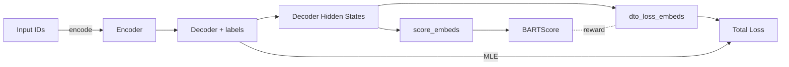

# Technical Implementation of Differentiable Training Objectives (DTO)

This document dives deeper into the **Differentiable Training Objective (DTO)** method used for counterfactual story rewriting with BART and BARTScore. We cover:

1. **What is DTO?**
2. **Why use a differentiable reward?**
3. **Core components and data flow**
4. **DTO Loss Computation (`dto_loss_embeds`)**
5. **Embedding-based Scoring (`score_embeds`)**
6. **Integration in the Training Loop**

---

## 1. What is DTO?

DTO is a framework that integrates a **continuous reward signal** (here, BARTScore) directly into gradient-based optimization. Instead of treating reward as a black-box (e.g., reinforcement learning), DTO:

* **Generates soft embeddings** via the model’s decoder (continuous representation).
* **Scores** these embeddings against ground-truth outputs using a differentiable metric model (BARTScore).
* **Backpropagates** through the metric model to update the generator, optimizing both likelihood and quality.

In essence, DTO turns a discrete evaluation metric into a continuous training objective, combining the stability of MLE with the expressiveness of learned rewards.

## 2. Why use a differentiable reward?

* **Stability**: Avoids high-variance gradient estimators common in policy gradient methods.
* **Speed**: End-to-end backprop is more efficient than sampling-based RL.
* **Quality**: Aligns model outputs with human-centric metrics (e.g., semantic similarity via BARTScore).

---

## 3. Core Components and Data Flow



* **Encoder** & **Decoder**: Produce soft embeddings instead of discrete tokens.
* **score\_embeds**: Computes BARTScore on embeddings vs. reference texts.
* **dto\_loss\_embeds**: Converts scores to a differentiable loss.
* **Total Loss**: Weighted sum of MLE and DTO losses.

---

## 4. DTO Loss Computation (`dto_loss_embeds`)

```python
def dto_loss_embeds(self, expected_embeddings, edited_endings):
    """
    Compute the DTO loss as the negative average BARTScore.

    Args:
      expected_embeddings (Tensor): Decoder embeddings [batch, seq_len, hidden_dim]
      edited_endings (List[str]): Ground-truth endings

    Returns:
      Tensor: Differentiable scalar loss
    """
    # Ensure metric model is frozen
    for p in self.metrics_evaluator.bart_scorer.model.parameters():
        if p.requires_grad:
            raise RuntimeError("BART Scorer should be in eval mode.")

    # Score each example: returns Tensor of shape [batch]
    score_tensor = self.metrics_evaluator.calculate_score_embeds(
        inputs_embeds=expected_embeddings,
        tgts=edited_endings
    )  # requires_grad=False

    # Negative mean to convert reward → loss
    loss = - score_tensor.mean()

    # Confirm gradient flow
    assert loss.requires_grad, "DTO loss must require gradients."
    return loss
```

**Key Points**:

* We use **soft embeddings** to bypass discrete argmax.
* `calculate_score_embeds` returns non-differentiable scores, but embedding path remains differentiable.
* Taking the mean and negating aligns maximization of score with minimization of loss.

---

## 5. Embedding-based Scoring (`score_embeds`)

```python
def score_embeds(self, inputs_embeds, tgts, batch_size=4):
    """
    Compute BARTScore on continuous embeddings.
    """
    all_scores = []
    # Process in small batches to save memory
    for start in range(0, len(inputs_embeds), batch_size):
        batch_embeds = inputs_embeds[start:start+batch_size]
        tgt_texts   = tgts[start:start+batch_size]

        with torch.no_grad():
            # Tokenize reference texts
            enc = self.tokenizer(
                tgt_texts,
                return_tensors='pt',
                padding=True,
                truncation=True,
                max_length=self.max_length
            )
            labels = enc['input_ids'].to(self.device)
            mask   = enc['attention_mask'].to(self.device)
            lengths = mask.sum(dim=1)

            # Create encoder mask [batch, seq_len]
            enc_mask = torch.ones(
                batch_embeds.size(0),
                batch_embeds.size(1),
                device=self.device,
                dtype=torch.long
            )

            # Forward pass using embeddings
            out = self.model(
                inputs_embeds=batch_embeds,
                attention_mask=enc_mask,
                labels=labels
            )

            # Compute token-level NLL: loss_fct(LogSoftmax(logits), labels)
            logits = out.logits.view(-1, self.model.config.vocab_size)
            token_losses = self.loss_fct(
                self.lsm(logits),
                labels.view(-1)
            ).view(labels.size(0), -1)

            # Sum per-example, normalize by length, invert sign
            nll = token_losses.sum(dim=1) / lengths
            scores = (-nll).tolist()
            all_scores.extend(scores)

    return torch.tensor(all_scores, device=self.device)
```

**Key Points**:

* **No gradient** through scoring ensures stable reward.
* Manual NLL computation yields exact log-probabilities.
* Normalizing by length avoids bias towards shorter references.

---

## 6. Integration in the Training Loop

Inside `BartFineTuner` (LightningModule):

```python
class BartFineTuner(pl.LightningModule):
    def training_step(self, batch, _):
        # 1. Forward for MLE + capture hidden states
        out = self.model(
            input_ids=batch['input_ids'],
            attention_mask=batch['attention_mask'],
            labels=batch['labels'],
            output_hidden_states=True,
            return_dict=True
        )
        mle_loss = out.loss
        embeds   = out.decoder_hidden_states[-1]  # [B, T, H]

        # 2. Compute DTO loss
        dto_loss = self.dto_loss_embeds(
            expected_embeddings=embeds,
            edited_endings=batch['edited_ending']
        )

        # 3. Combine and backprop
        total_loss = mle_loss + self.dto_weight * dto_loss
        self.log('train/mle_loss', mle_loss)
        self.log('train/dto_loss', dto_loss)
        return total_loss
```

**Highlights**:

* **Dual objectives**: Supervised MLE + reward-driven DTO.
* **Hyperparameter** `dto_weight` balances content fidelity and metric optimization.
* **End-to-end gradients** flow from DTO loss back into generator.

---

This enhanced technical guide clarifies how DTO transforms discrete metrics into a continuous, differentiable objective, enabling more effective fine-tuning of generative models for counterfactual story rewriting.

---

## 7. Reward Function: BARTScore

In our DTO framework, the **reward** is provided by **BARTScore**, a learned evaluation metric based on a pretrained/fine-tuned BART model (here `facebook/bart-large-cnn`). BARTScore evaluates the conditional likelihood of a reference text given model outputs, combining fluency and semantic fidelity into a single scalar reward.

**High-level Steps:**

1. **Soft Embeddings Input**: Instead of discrete tokens, we feed continuous `inputs_embeds` (decoder hidden states) into the BART scorer’s encoder.
2. **Decoder Forward**: The scorer’s decoder consumes those embeddings along with `attention_mask` and computes logits over the vocabulary.
3. **Reference Tokenization**: Ground-truth endings are tokenized to `reference_ids` and masked by `attention_mask`.
4. **NLL Computation**: We compute the negative log-likelihood (NLL) of each reference token under the predicted logits via `LogSoftmax` and `NLLLoss`.
5. **Normalization**: Sum token-level losses and divide by the number of non-pad tokens to get average NLL per example.
6. **Score→Reward**: Negate the average NLL (`reward = - avg_nll`) so that **higher BARTScore means better alignment** with the reference.

**Why This Reward?**

* **Differentiability**: By operating on embeddings with a frozen BART scorer, gradients flow from `dto_loss_embeds` back into the generator without discrete sampling.
* **Rich Signal**: Captures syntactic correctness and semantic relevance through BART’s learned representations.
* **Stable Learning**: Avoids variance of sampling-based methods (e.g., RL) while directly optimizing for a powerful metric.

**Concrete Implementation Snippet** (inside `MetricsEvaluator.calculate_score_embeds`):

```python
with torch.no_grad():
    # Prepare reference tokens
    enc = tokenizer(
        tgts, padding=True, truncation=True, max_length=self.max_length, return_tensors="pt"
    )
    reference_ids  = enc.input_ids.to(self.device)
    reference_mask = enc.attention_mask.to(self.device)

    # Build encoder mask matching embed length
    emb_mask = torch.ones(
        batch_embeds.size(0), batch_embeds.size(1), device=self.device
    )

    # Forward through BART scorer
    out = self.bart_scorer(
        inputs_embeds=batch_embeds,            # [B, T, H]
        attention_mask=emb_mask,               # [B, T]
        labels=reference_ids                   # [B, L]
    )

    # out.loss is averaged NLL per token by default
    avg_nll = out.loss
    bart_score = -avg_nll                    # Reward: higher is better
```

**Integration in DTO Loss**:

```python
score_tensor = self.metrics_evaluator.calculate_score_embeds(
    inputs_embeds=expected_embeddings,
    tgts=edited_endings
)   # Tensor[batch] of BARTScores

# Convert reward to loss
dto_loss = -score_tensor.mean()
```

By maximizing this reward within the overall training objective (`MLE_loss + λ * DTO_loss`), the generator learns to produce endings that score highly under BARTScore, yielding outputs that are both fluent and semantically aligned with the counterfactual reference.

